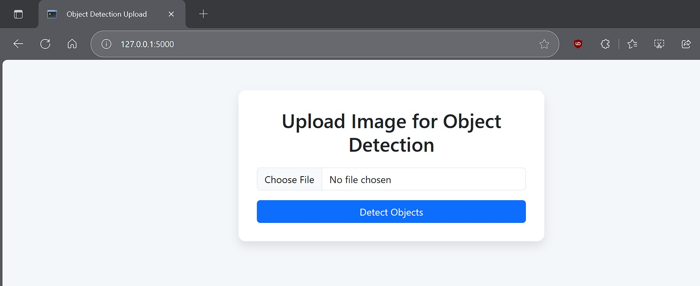
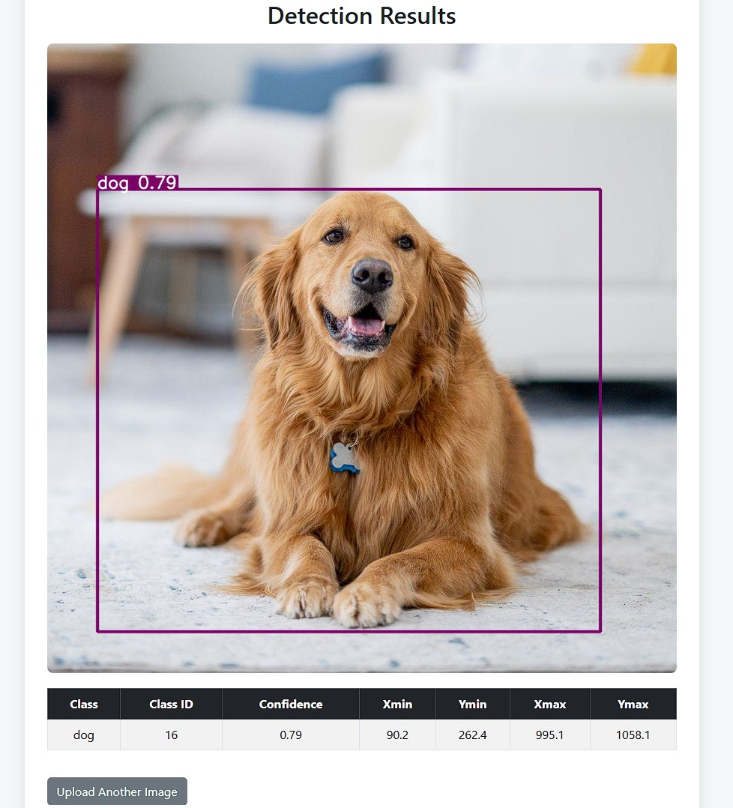

# Object Detection Microservice

This repo contains two services that together implement an image object-detection microservice:

* **UI backend (Flask)** — simple web UI to upload images and display results.
* **AI backend (FastAPI + YOLO)** — accepts images, runs object detection, saves an annotated image and a JSON file with detections, and returns structured results.

---

## Prerequisites

1. **Docker & Docker Compose** (recommended) OR
2. **Python 3.8+** and `pip` (for local runs)
3. Internet access on first run (the YOLO model weights are downloaded automatically unless already cached)
4. (Optional) GPU + CUDA if you want GPU inference — update Docker images / host accordingly.

---

## Quick Overview of Flow

1. User uploads image on the UI.
2. UI sends image (HTTP POST) to AI backend `/predict/`.
3. AI backend runs model, saves:

   * annotated image: `AI_Backend/outputs/images/<uuid>.jpg`
   * JSON results: `AI_Backend/outputs/json/<uuid>.json`
4. AI backend returns JSON with detections and paths.
5. UI copies annotated image to its `static/` folder and renders `result.html`.

---


## 📂 Project Structure
```
AIMonk_Assignment
│
├── docker-compose.yml
│
├── AI_Backend
│ ├── ai_backend.py
│ ├── requirements.txt
│ ├── Dockerfile
│ ├── outputs/            # (optional; will be created)
│
├── UI_Backend
│ ├── ui_backend.py
│ ├── requirements.txt
│ ├── Dockerfile
│ ├── templates
│ │ ├── index.html
│ │ ├── result.html
│ ├── static/             # (optional)
│
├── Results
│ ├──
│ ├──

```

--

## Results

<p align="center">

  
</p>

<p align="center">
  
</p>


--

## 1. Quick Start — Docker (recommended)

From repository root (where `docker-compose.yaml` lives):

1. Build and start services:

```bash
docker-compose up --build -d
```

2. Check that containers are up:

```bash
docker-compose ps
docker-compose logs -f
```

3. Open UI in your browser:

```
http://127.0.0.1:5000
```

4. To stop and remove containers:

```bash
docker-compose down
```

**Notes**

* `AI_BACKEND_URL` is set in `docker-compose.yaml` to `http://ai_backend:8000/predict/` so the UI service can reach the AI container by service name.
* The compose file mounts `./AI_Backend/outputs` and `./UI_Backend/static` to persist outputs to the host.

---

## 2. Local Development (no Docker)

Run the AI backend and UI backend locally on your machine.

### AI backend (FastAPI)

```bash
cd AI_Backend
python3 -m venv venv && source venv/bin/activate    # mac/linux
# On Windows use: python -m venv venv & venv\Scripts\activate

pip install -r requirements.txt

# Start FastAPI
uvicorn ai_backend:app --host 0.0.0.0 --port 8000
```

API endpoints:

* `GET /` → health check
* `POST /predict/` → accepts multipart `file` form field

### UI backend (Flask)

Open a new terminal:

```bash
cd UI_Backend
python3 -m venv venv && source venv/bin/activate
pip install -r requirements.txt

# Ensure environment points to your AI backend (default localhost)
export AI_BACKEND_URL="http://127.0.0.1:8000/predict/"   # mac/linux
# On Windows CMD: set AI_BACKEND_URL=http://127.0.0.1:8000/predict/
python ui_backend.py
```

Open:

```
http://127.0.0.1:5000
```

---

## 3. Test the AI Backend directly (curl)

Send an image to the AI backend:

```bash
curl -F "file=@/full/path/to/image.jpg" http://127.0.0.1:8000/predict/
```

Example (trimmed) JSON response:

```json
{
  "detections": [
    {
      "class_id": 0,
      "class": "person",
      "confidence": 0.8734,
      "bbox": {"xmin": 34.5, "ymin": 45.2, "xmax": 120.7, "ymax": 220.3}
    }
  ],
  "image_path": "outputs/images/2f3b8a6a-....jpg",
  "json_path": "outputs/json/2f3b8a6a-....json"
}
```

* `image_path` and `json_path` are paths inside the AI backend container (relative to `/app`).
* The UI uses these values to locate and copy the annotated image to its `static/` folder for display.

---

## 4. Where outputs are saved

* Annotated images: `AI_Backend/outputs/images/`
* JSON results: `AI_Backend/outputs/json/`

When running with Docker Compose, `./AI_Backend/outputs` is typically mounted to the host (per the compose file), so you can access outputs directly from your filesystem.

---

## 5. Packaging / Deliverables (what to send)

1. Project folder zipped (maintain same relative paths). Example:

```bash
zip -r submission.zip AI_Backend UI_Backend docker-compose.yaml README.md outputs
```

2. Documentation: include a short `DOCUMENTATION.md` describing:

   * steps you took to implement
   * references and links
   * any changes you made to sample code
3. Example outputs: include a few annotated images and their JSON files (from `AI_Backend/outputs`).

---

## 6. Troubleshooting & Tips

* **Model download stalls or fails**: first run downloads weights; ensure container/host has internet.
* **Slow CPU inference**: CPU-only inference is slower—use `yolov5s` (already used) or `yolov5n` for speed. To use GPU, ensure correct torch & CUDA match and change `model.to("cuda")`.
* **Permission errors with volumes**: check directory ownership and adjust permissions (e.g., `chmod -R 755 AI_Backend/outputs`).
* **Path issues when copying annotated images**: ensure you run Flask from repo root (compose ensures paths), or update path logic in `ui_backend.py`.
* **Port in use**: change ports in `docker-compose.yaml` or stop the service occupying that port.
* **Torch compatibility**: if `torch` install fails in slim images, consider using `pytorch` official images or a fuller base image with system dependencies.

---


## 8. References

* Ultralytics (YOLO): [https://github.com/ultralytics/yolov3](https://github.com/ultralytics/yolov3) (or Ultralytics YOLO repo)
* FastAPI docs: [https://fastapi.tiangolo.com](https://fastapi.tiangolo.com)
* Flask docs: [https://flask.palletsprojects.com](https://flask.palletsprojects.com)

---

## 9. Author / Contact

Dr. Amit Chougule, PhD
[amitchougule121@gmail.com](mailto:amitchougule121@gmail.com)

---


